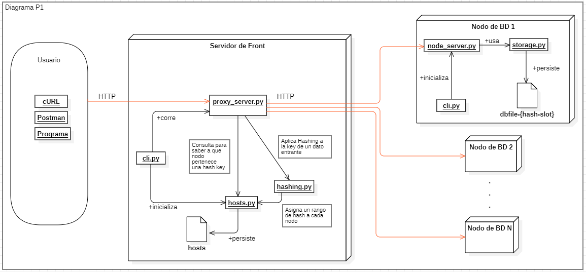

# ST0263_P1
Proyecto 1 Topicos Especiales en Telematica.

Testeado en Windows, con Python 3.7.


### Integrante:
* Santiago Vanegas / svaneg11@eafit.edu.co
 

### Arquitectura


#### Nodos de BD
* Los nodos pueden hacer GET, SET y DELETE
* Persisten los datos usando un archivo por cada hash_slot.
* Cada key con el hash_slot **x** es persistido en el archivo dbfile-{**x**}
* Cada nodo de base de datos tiene su propio servidor, el cual expone los metodos 
GET, SET y DELETE.
* Los nodos no tienen idea del particionamiento

#### Servidor de Front
* El servidor de front se comunica con todos los nodos a traves de los endpoints que estos exponen.
* A su vez, el servidor de front tambien tiene un servidor diferente al de los nodos,
el cual habilita endpoints para que los clientes se comuniquen a traves de http.
* El servidor de front asigna a cada nodo un rango de key hashes.
* El servidor de front persiste a que nodo pertenece un rango de hashes usando el archivo hosts.
* El servidor de front se encarga de aplicar hash CRC16 a la llave de cada nuevo dato
y en base a el hash resultante decide a que nodo de BD enviarlo BD.

## Como correr el proyecto en  modo cluster
1. Ubicarse en la carpeta ST0263_P1

```cmd
cd ST0263_P1
```

2. Instalar los archivos de requirements.txt

```cmd
pip install -r requirements.txt
```

3. Abrir diferentes terminales para cada nodo y una adicional para el servidor front

4. En cada terminal correr el siguiente comando para inicializar cada nodo (ejemplo con 4 nodos)

```cmd
python cli.py node 6000
```

```cmd
python cli.py node 7000
```

```cmd
python cli.py node 8000
```

```cmd
python cli.py node 9000
```

5. Para la terminal del servidor front correr los siguientes dos comandos

   1. Inicializar el archivo de hosts para que el servidor sepa que nodos estan disponibles: 
   
   ```cmd
   python cli.py server 5000 -n 127.0.0.1 6000  -n 127.0.0.1 7000 -n 127.0.0.1 8000 -n 127.0.0.1 9000
   ```

   2. Correr el servidor:
   ```cmd
   python cli.py server 5000 --start
    ```

6. Ahora se puede proceder a probar usando Postman o cURL
   1. Postman
   
      1. Instalar Postman e importar la coleccion `P1.postman_collection.json`
      2. Usar los metodos ubicados en la carpeta Proxy Server
   2. Ejemplos con CURL
      1. GET
      ```cmd
      curl -v "http://127.0.0.1:5000/?key=my_key35"
      ```
      2. SET
      ```cmd
      curl -v -X POST "http://127.0.0.1:5000/" -H "Content-Type: application/json" -d "{\"key\": \"my_key35\", \"value\": \"my_value35\"}"
      ```
      3. DELETE
      ```cmd
      curl -v -X DELETE "http://127.0.0.1:5000/?key=my_key35"
      ```

#### Documentacion de endpoints con OpenAPI
Mientras el servidor corre abrir el navegador y acceder a
```host:port/docs```


## Como testear el nodo de BD (Single server)
1. Ubicarse en la carpeta ST0263_P1

```cd ST0263_P1```

2. Instalar los archivos de requirements.txt

```pip install -r requirements.txt```

3. Correr con python el archivo  ST0263_P1/node/setup_node.py

4. Descargar Postman y importar la coleccion de Postman.

5. Hacer las pruebas que quiera usando los métodos de la colección de Postman.

#### Documentacion de endpoints con OpenAPI
Mientras el servidor corre abrir el navegador y acceder a
```host:port/docs```